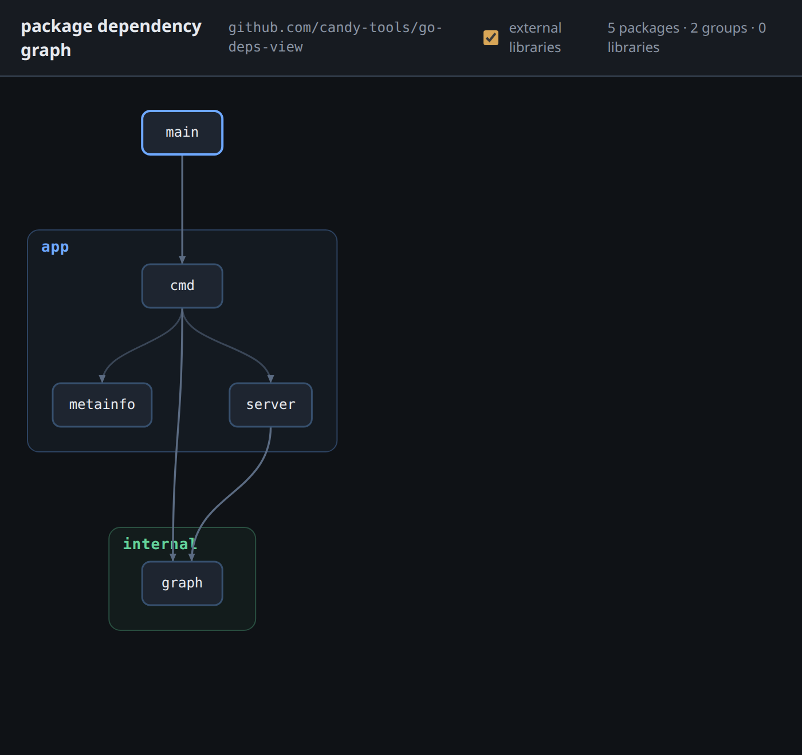

# go-deps-view

View a graphical representation of a Go module's package dependencies in the
browser: the entrypoint at the top, packages grouped into nested folder boxes,
arrows following the imports, and the external libraries off to the side.

It shells out to `go list -deps -json ./...` in the target module and serves the
graph to a small, dependency-free browser viewer that is embedded in the binary.
All grouping and layout is derived from the package paths.



> **Requires the Go toolchain on `PATH`.** The graph is built by running
> `go list` against the target module on each request.

## Install

```sh
go install github.com/candy-tools/go-deps-view@latest
```

Tagged releases also publish prebuilt binaries for Linux and macOS (amd64 / arm64):

- **Archives** — download a `go-deps-view_<OS>_<arch>.tar.gz` from the
  [releases page](https://github.com/candy-tools/go-deps-view/releases).
- **Homebrew (macOS)** — `brew install --cask candy-tools/tap/go-deps-view`.
- **Debian/Ubuntu** — download the `.deb` from the releases page and
  `sudo dpkg -i go-deps-view_*.deb`.

## Usage

Run it against the current module, or point it at another with `-dir`:

```sh
go-deps-view                       # scan ., serve on http://localhost:8099
go-deps-view -dir /path/to/module  # scan another module
go-deps-view -addr :9000           # different port
go-deps-view -exclude /testdata,/mocks
go-deps-view -json                 # print the graph JSON and exit (no server)
go-deps-view -version              # print version information and exit
```

From a checkout you can run it straight from source with `go run .` in place of
the installed binary. Stop the server with `Ctrl-C`.

## What you see

- **Folder boxes** — the viewer builds a folder tree from the package paths and
  draws each folder as a nested box (`./internal/model/foo` → a `foo` node in a
  `model` box in an `internal` box). Root packages such as `main` render bare at
  the top. Inside each box, items are stacked into rows by a longest-path
  layering, so a well-layered folder reads as a top-to-bottom pyramid.
- **Import arrows** connect individual packages; each incoming arrow lands at its
  own point on a package's top edge. Edges crossing a top-level folder use a
  distinct colour.
- **Libraries** — external dependency modules imported directly by the project
  sit in a box on the right, toggled by the **external libraries** checkbox
  (standard-library imports are always excluded).
- Hover a node to highlight its neighbours and the edges touching it.

## JSON output (`-json`)

```json
{
  "module": "example.com/mod",
  "nodes": [
    { "id": ".",         "pkg": "example.com/mod" },
    { "id": "./app/cmd", "pkg": "example.com/mod/app/cmd" }
  ],
  "edges":    [{ "from": ".", "to": "./app/cmd" }],
  "libs":     [{ "id": "github.com/gorilla/mux", "label": "gorilla/mux" }],
  "libEdges": [{ "from": ".", "to": "github.com/gorilla/mux" }]
}
```

- `nodes` — in-module packages; `id` is the module-relative path (`.` is `main`).
- `edges` — `from imports to` (project package → project package).
- `libs` — external dependency modules; `id` is the module path, `label` the
  shortened display name.
- `libEdges` — `package imports library`.

Empty collections are emitted as `[]` (never `null`), and standard-library
imports are excluded.

## Project layout

- `main.go` — thin entrypoint.
- `app/cmd` — flag parsing (`-dir`, `-addr`, `-exclude`, `-json`, `-version`) and dispatch.
- `app/server` — the HTTP handlers and the embedded, dependency-free viewer (`index.html`).
- `internal/graph` — the graph builder (shells out to `go list`) and the JSON model.
- `app/metainfo` — build/version metadata stamped in at release time.

## Development

```sh
make verify   # test + license-check + lint + benchmark + coverage (the full gate)
make run      # build + serve on http://localhost:8099 (DIR=/path to scan elsewhere)
make build    # goreleaser snapshot build → ./dist
```

Agent-facing notes live in [`docs/agents/`](docs/agents/) and [`AGENTS.md`](AGENTS.md);
releases are cut with `make tag version="vX.Y.Z"` (see
[`docs/agents/releasing.md`](docs/agents/releasing.md)).
